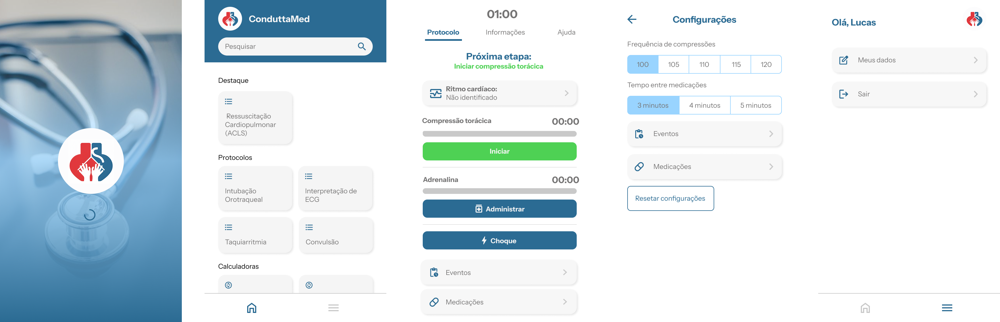

# <div align="center">⚕️ ConduttaMed ⚕️</div>
<p align="center">Seu aliado essencial na prática clínica, oferecendo protocolos, calculadoras e informações cruciais para a tomada de decisões rápidas e precisas.</p>
<br>

## 📱 Apresentação UI


## 🚀 Tecnologias Utilizadas

Este aplicativo Flutter foi construído utilizando as seguintes tecnologias e padrões de arquitetura:

* **Flutter:** Framework de UI para desenvolvimento multiplataforma.
* **Bloc/Cubit:** Padrão de gerenciamento de estados reativo e previsível, facilitando a construção de interfaces complexas e a separação de responsabilidades.
* **Modular:** Poderoso gerenciador de dependências e sistema de rotas para Flutter, promovendo a modularização, organização e escalabilidade do código.

## ✨ Funcionalidades Principais

O ConduttaMed oferece um conjunto de ferramentas essenciais para profissionais de saúde:

* **Protocolos Essenciais:**
    * ACLS (Suporte Avançado de Vida em Cardiologia)
    * Manejo de Taquiarritmias
* **Calculadoras Médicas:**
    * Cálculo de Velocidade de Infusão
* **Informações Clínicas:**
    * Dados relevantes sobre Distúrbios Hidroeletônicos

## 📱 Como Utilizar

Para explorar o ConduttaMed, siga os passos abaixo:

1.  **Acesse o Repositório no GitHub:** Visite o repositório do projeto em [https://github.com/GiovaneLopes/ConduttaMed](https://github.com/GiovaneLopes/ConduttaMed).

2.  **Clone o Repositório:** No seu terminal, navegue até o diretório onde você deseja clonar o projeto e execute o seguinte comando:
    ```bash
    git clone [https://github.com/GiovaneLopes/ConduttaMed.git](https://github.com/GiovaneLopes/ConduttaMed.git)
    cd ConduttaMed
    ```

3.  **Obtenha as Dependências:** Certifique-se de ter o Flutter instalado em sua máquina. Execute o seguinte comando para baixar todas as dependências necessárias para o projeto:
    ```bash
    flutter pub get
    ```

4.  **Execute o Aplicativo:** Conecte um dispositivo físico ou utilize um emulador/simulador Flutter e execute o aplicativo com o comando:
    ```bash
    flutter run
    ```